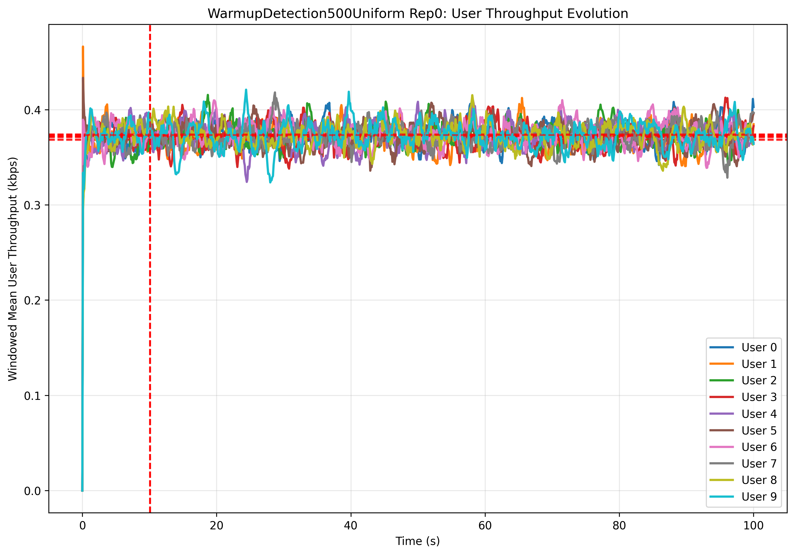

# Computer Engineering
## Performance Evaluation of Computer Systems and Networks


---

# Round-Robin Cellular Network
## Project Documentation

**Author:** Ayoub El Ourrak
**Year:** 2024/2025

---

# Table of Contents

1. [Introduction](#1.introduction)
   - 1.1 [Project Overview](#1.1.project.overview)
   - 1.2 [Theoretical Background](#1.2.theoretical.background)
1. [System Architecture and Design](#2.system.architecture.and.design)
   - 2.1 [Overall Architecture](#2.1.overall.architecture)
   - 2.2 [Component Description](#2.2.component.description)
   - 2.3 [Message Types](#2.3.message.types)
1. [Implementation Details](#3.implementation.details)
   - 3.1 [OMNeT++ Framework](#3.1.omnet.framework)
   - 3.2 [Core Module Implementation](#3.2.core.module.implementation)
   - 3.3 [Random Number Generation](#3.3.random.number.generation)
1. [Simulation Framework](#4.simulation.framework)
   - 4.1 [Simulation Parameters](#4.1.simulation.parameters)
   - 4.2 [Simulation Scenarios](#4.2.simulation.scenarios)
   - 4.3 [Warm-up and Simulation Period Determination](#4.3.warm-up.and.simulation.period.determination)
   - 4.4 [Performance Metrics](#4.4.performance.metrics)
1. [Validation](#5.validation)
   - 5.1 [Validation Methodology](#5.1.validation.methodology)
   - 5.2 [Validation Test Results](#5.2.validation.test.results)
1. [Performance Evaluation](#6.performance.evaluation)
   - 6.1 [Uniform CQI Scenario Analysis](#6.1.uniform.cqi.scenario.analysis)
   - 6.2 [Binomial CQI Scenario Analysis](#6.2.binomial.cqi.scenario.analysis)

---

# 1. Introduction

## 1.1 Project Overview

This project presents a simulation study of a Round Robin scheduling algorithm with Channel Quality Indicator (CQI) feedback in cellular networks. The implementation was developed using OMNeT++, a discrete event simulation framework, to analyze the performance characteristics of resource allocation in modern cellular systems.

The primary objective is to evaluate how different CQI distributions affect system throughput, user fairness, and response times in a multi-user cellular environment.

The study focuses on two main scenarios that represent real-world cellular network conditions:
1. **Uniform CQI distribution** - representing mobile users moving through different areas with varying signal conditions
2. **Binomial CQI distribution** - representing fixed-position users with stable but varying channel conditions based on their location and environmental factors

This project provides:
- A detailed implementation of a Round Robin scheduler with realistic channel feedback mechanisms
- Validation tests ensuring the correctness of the simulation model
- Performance analysis under various load conditions and channel quality distributions

## 1.2 Theoretical Background

### 1.2.1 Cellular Network Architecture

Modern cellular networks operate on the principle of dividing geographical areas into cells, each served by a base station. The base station manages radio resources and coordinates communication between mobile users and the core network. Resources are organized in both time and frequency domains.

### 1.2.2 Resource Block Structure

The fundamental unit of resource allocation is the Resource Block (RB), which represents the smallest assignable resource unit.

In this simulation model:
- Each frame contains **25 Resource Blocks**, representing the frequency dimension
- Time is divided into **Transmission Time Intervals (TTIs) of 1ms**, representing the time dimension
- RB capacity varies based on channel quality, ranging from **3 to 93 bytes**

### 1.2.3 Channel Quality Indicator (CQI)

Channel Quality Indicator (CQI) is a crucial feedback mechanism in cellular networks where users report their perceived channel quality to the base station. This feedback enables the base station to adapt its transmission parameters to match the current channel conditions.

In this simulation, CQI values range from 1 to 15, with each value corresponding to a specific number of bytes that can be transmitted:

| CQI | Bytes per RB |
|:-----:|:------:|
| 1   | 3    |
| 2   | 3    |
| 3   | 6    |
| 4   | 11   |
| 5   | 15   |
| 6   | 20   |
| 7   | 25   |
| 8   | 36   |
| 9   | 39   |
| 10  | 50   |
| 11  | 63   |
| 12  | 72   |
| 13  | 80   |
| 14  | 93   |
| 15  | 93   |

### 1.2.4 Scheduling Algorithms

Round Robin (RR) is a fair scheduling algorithm that serves users in a circular order. Each user gets a turn to transmit, ensuring no user is starved of resources. The basic algorithm:
1. Maintains a pointer to the current user
2. Allocates available resources starting from the current user
3. Moves to the next user when the current user's queue is empty or resources are exhausted
4. Wraps around to the first user after the last

### 1.2.5 Performance Metrics

Evaluating scheduler performance requires multiple metrics that capture different aspects of system behavior:

**Throughput**:
- **User throughput**: Data rate achieved by individual users (bits/second)
- **System throughput**: Data rate achieved by the base station (bits/second)

**Response Time**:
- Time between packet creation at the user equipmentand successful transmission from the base station

**Resource Utilization**:
- Number of RBs used in each TTI
- Indicates system load and efficiency

---

# 2. System Architecture and Design

## 2.1 Overall Architecture

The simulated cellular network follows a hierarchical design pattern that mirrors real-world cellular systems while maintaining the simplicity necessary for focused performance analysis. The architecture consists of three main hierarchical levels:

1. **Network Level**: The top-level container that represents the entire cellular system
2. **Node Level**: Individual network entities (Base Station and User Equipment)
3. **Module Level**: Functional components within each node

|  |
| :---------------------------------------------------: |
|               *Network*                |

## 2.2 Component Description

### 2.2.1 User Equipment (UE)

Each User Equipment module simulates a mobile device with traffic generation and channel reporting capabilities. The UE implementation implement several key functionalities:

**Traffic Generation**:
The traffic generation module implements configurable arrival patterns to simulate different application behaviors:
- **Exponential arrivals**
- **Fixed-rate arrivals**
- **Packet size distribution**: Uniform distribution between 1 and 75 bytes

**Channel Quality Reporting**:
The CQI reporting mechanism simulates the feedback loop present in real cellular systems:
- Periodic CQI updates triggered by base station requests
- CQI generation based on configured distribution (uniform or binomial)

**Statistics Collection**:
Each UE maintains detailed statistics for performance analysis:
- Inter-arrival times 
- Packet counts and sizes
- CQI history

**State Management**:
The UE maintains several state variables:
- Current CQI value
- Sequence numbers for packet tracking
- Timing information for statistical analysis

### 2.2.2 Base Station

|  |
|:--:|
| *Base Station* |

The base station represents the central intelligence of the cellular system, containing multiple sub-modules that work together to manage resources and serve users efficiently.

**Router Module**:
The router acts as the initial processing point for all uplink messages:
- Separates data packets from control messages (CQI reports)
- Maintains user-to-queue mapping for efficient routing

**FIFO Queue Array**:
The base station maintains a separate FIFO queue for each user, providing:
- **Isolation**: One user's traffic cannot affect another's queue
- **Fairness**: Preserves packet arrival order per user
- **Simplicity**: Easy to implement and analyze

**Scheduler Module**:
The scheduler represents the core intelligence of the base station, implementing the Round Robin algorithm with several features:

1. **TTI Management**:
   - Self-clocking mechanism using scheduled messages
   - Precise 1ms TTI
   - Synchronization with user CQI reports

2. **CQI Collection**:
   - Broadcasts CQI requests at each TTI start
   - Waits for all users to report before scheduling
   - Maintains current CQI state for all users

3. **Resource Allocation**:
   - Implements pure Round Robin user selection
   - Calculates resource requirements based on queue state and CQI
   - Generates scheduling grants with precise resource assignments

4. **Statistics Generation**:
   - Tracks resource utilization per TTI
   - Monitors scheduled users and transmitted bytes
   - Provides detailed logging for debugging and analysis

### 2.2.3 Inter-Module Communication

The system uses OMNeT++'s gate-based communication model, the communication patterns include:
1. **Uplink data path**: UE → Router → Queue
2. **CQI reporting path**: UE → Router → Scheduler
3. **Scheduling grant path**: Scheduler → UE
4. **CQI request path**: Scheduler → UE

## 2.3 Message Types

The system defines four distinct message types, each serving a specific purpose in the cellular communication protocol:

### 2.3.1 DataPacket

The DataPacket represents user data with metadata for performance analysis:

```cpp
packet DataPacket {
    int userId;              // Source user identification
    int sequenceNumber;      // For packet tracking
    simtime_t creationTime;  // For response time calculation
}
```

Key features:
- Variable size (1-75 bytes) set at creation
- Timestamp for end-to-end delay measurement

### 2.3.2 CQIReport

CQIReport messages carry channel quality feedback from users to the scheduler:

```cpp
message CQIReport {
    int userId;     // Reporting user
    int cqiValue;   // Channel quality (1-15)
}
```

### 2.3.3 SchedulingGrant

SchedulingGrant messages inform users about their resource allocations at the base station for a given TTI:

```cpp
message SchedulingGrant {
    int userId;           // Target user
    int allocatedBytes;   // Total bytes transmitted
    int allocatedRBs;     // Number of RBs allocated in the frame
}
```

### 2.3.4 TTIEvent

TTIEvent is an internal scheduling message for TTI timing:

```cpp
message TTIEvent {
    int ttiNumber;    // TTI sequence number for debugging
}
```

---

# 3. Implementation Details

## 3.1 OMNeT++ Framework

The implementation leverages OMNeT++, a powerful discrete event simulation framework. OMNeT++ provides several key features that make it ideal for our cellular network simulation:

**Component-Based Architecture**:
OMNeT++ uses a hierarchical component model where:
- **Simple modules** contain the actual implementation logic in C++
- **Compound modules** compose simple modules into complex structures
- **Networks** represent complete system configurations

This architecture allows for excellent code reuse and modular design. In our implementation, we use simple modules for all functional components (UE, Router, Queue, Scheduler) and compound modules for structural organization (BaseStation).

**Message-Based Communication**:
All inter-module communication occurs through message passing, which:
- Accurately models the asynchronous nature of network protocols
- Enables precise timing control
- Facilitates debugging through message inspection and tracing

**Configuration Management**:
OMNeT++ provides a configuration system through INI files:
- Parameters for comprehensive testing
- Multiple configurations in a single file
- Inheritance between configurations for code reuse

**Statistical Framework**:
The built-in statistical framework supports:
- Automatic collection of scalar and vector results
- Warm-up period handling for steady-state analysis
- Result filtering and recording control

## 3.2 Core Module Implementation

### 3.2.1 UserEquipment Implementation

The UserEquipment module represents the client-side logic in our simulation.

**Initialization and Configuration**:
The initialization establishes all operational parameters:

```cpp
void UserEquipment::initialize()
{
    // Identity and traffic parameters
    userId = par("userId");
    arrivalRate = par("arrivalRate");
    maxPacketSize = par("maxPacketSize");
    arrivalPattern = par("arrivalPattern").stringValue();
    packetPattern = par("packetPattern").stringValue();
    
    // CQI model configuration
    cqiModel = par("cqiModel").stringValue();
    maxCQI = par("maxCQI");
    
    // RNG stream assignment for reproducibility
    arrivalRngId = par("arrivalRngId");
    sizeRngId = par("sizeRngId");
    cqiRngId = par("cqiRngId");
    
    // Binomial-specific parameters
    if (cqiModel == "binomial") {
        binomialN = par("binomialN");
        binomialP = par("binomialP");
    }
    
    // Signal registration for statistics
    packetsGeneratedSignal = registerSignal("packetGenerated");
    cqiValueSignal = registerSignal("cqiValue");
    interArrivalTimeSignal = registerSignal("interArrivalTime");
    packetDimensionSignal = registerSignal("packetDimension");
    
    // Schedule first packet
    nextArrivalEvent = new cMessage("nextArrival");
    scheduleNextArrival();
}
```

This initialization demonstrates some important principles:
1. **Parameter flexibility**: All behavior is configurable
2. **RNG management**: Separate streams ensure independence
3. **Signal-based statistics**: Decouples measurement from logic
4. **Event-driven design**: Self-scheduling for packet generation

**Traffic Generation Logic**:
The traffic generation implements a self-scheduling pattern common in discrete event simulation:

```cpp
void UserEquipment::generatePacket() {
    // Create packet
    DataPacket *packet = new DataPacket("dataPacket");
    packet->setUserId(userId);
    packet->setSequenceNumber(sequenceNumber++);
    packet->setByteLength(getPacketSize());
    packet->setCreationTime(simTime());
    
    // Emit statistics
    emit(packetDimensionSignal, packet->getByteLength());
    
    // Track inter-arrival times
    if (lastArrivalTime > 0) {
        simtime_t interArrival = simTime() - lastArrivalTime;
        emit(interArrivalTimeSignal, interArrival);
    }
    lastArrivalTime = simTime();
    
    // Send packet to base station
    send(packet, "out");
}
```

The packet generation process:
1. Creates packets with unique identifiers
2. Timestamps for delay measurement
3. Emits signals for statistical collection
4. Maintains state for inter-arrival tracking

**Channel Quality Modeling**:
The CQI generation supports multiple models to represent different user scenarios:

```cpp
int UserEquipment::generateCQI() {
    if (cqiModel == "binomial") {
        // Binomial distribution for clustered CQI values
        // Models users with stable positions
        return binomial(binomialN-1, binomialP, cqiRngId) + 1;
    }
    else if (cqiModel == "uniform") {
        // Uniform distribution for mobile users
        // Equal probability for all CQI values
        return intuniform(1, maxCQI, cqiRngId);
    }
    else {
        // Fixed CQI for testing
        return par("cqi").intValue();
    }
}
```

The binomial distribution is particularly interesting as it models users who tend to experience certain CQI values more frequently, representing:
- Users near the cell edge (low p-value)
- Users near the base station (high p-value)

### 3.2.2 Scheduler Implementation

The Scheduler module implements the core Round Robin algorithm and manages all resource allocation decisions. Its implementation showcases several advanced techniques for discrete event simulation.

**Data Structure Design**:
The scheduler maintains several coordinated data structures:

```cpp
class Scheduler : public cSimpleModule {
private:
    // Configuration
    int numUsers;
    int numResourceBlocks;
    simtime_t ttiDuration;
    
    // Round-robin state
    int currentUserIndex;      // Next user to serve
    long ttiCounter;          // TTI sequence number
    
    // User information
    std::vector<int> userCQI;                    // Current CQI values
    std::vector<FIFOQueue*> userQueues;          // Queue pointers
    std::vector<bool> cqiReceived;              // CQI collection flags
    int cqiReceivedCount;                        // Synchronization counter
    
    // TTI timing
    cMessage *ttiEvent;                          // Self-message for TTI
};
```

This structure enables:
- Efficient round-robin pointer management
- Synchronization of CQI collection
- Direct queue access for scheduling decisions

**TTI Synchronization**:
The scheduler implements a sophisticated synchronization mechanism:

```cpp
void Scheduler::handleTTIEvent() {
    ttiCounter++;
    
    // Phase 1: Request CQI updates
    requestCQIUpdates();
    
    // Phase 2: Schedule next TTI
    scheduleAt(simTime() + ttiDuration, ttiEvent);
}

void Scheduler::handleCQIReport(CQIReport *report) {
    // Update CQI value
    userCQI[report->getUserId()] = report->getCqiValue();
    
    // Track reception
    if (!cqiReceived[report->getUserId()]) {
        cqiReceived[report->getUserId()] = true;
        cqiReceivedCount++;
    }
    
    // Trigger scheduling when all received
    if (cqiReceivedCount == numUsers) {
        performRoundRobinScheduling();
        resetCQICollection();
    }
}
```

This two-phase approach ensures:
- Fresh CQI information for each TTI
- Synchronous scheduling decisions

**Round Robin Implementation**:
The core scheduling algorithm implements fair resource allocation:

```cpp
void Scheduler::performRoundRobinScheduling() {
    int startIndex = currentUserIndex;
    int rbsRemaining = numResourceBlocks;
    
    // Statistics tracking
    int rbsUsedThisTTI = 0;
    int usersScheduledThisTTI = 0;
    int bytesTransmittedThisTTI = 0;
    
    // Round-robin loop
    do {
        if (!userQueues[currentUserIndex]->isEmpty()) {
            // Get channel-dependent capacity
            int cqi = userCQI[currentUserIndex];
            int bytesPerRB = getBytesPerRB(cqi);
            
            // Query queue for transmittable packets
            QueueResult* result = userQueues[currentUserIndex]->
                getPacketsToTransmit(bytesPerRB, rbsRemaining);
            
            if (result->getBytesToTransmit() > 0) {
                // Update statistics
                usersScheduledThisTTI++;
                bytesTransmittedThisTTI += result->getBytesToTransmit();
                rbsUsedThisTTI += result->getRbUsed();
                rbsRemaining -= result->getRbUsed();
                
                // Send grant to user
                sendSchedulingGrant(currentUserIndex,
                    result->getBytesToTransmit(),
                    result->getRbUsed());
            }
        }
        
        // Move to next user
        currentUserIndex = (currentUserIndex + 1) % numUsers;
        
    } while (currentUserIndex != startIndex && rbsRemaining > 0);
    
    // Advance round-robin pointer for next TTI
    currentUserIndex = (startIndex + 1) % numUsers;
    
    // Emit statistics
    emit(rbUtilizationSignal, rbsUsedThisTTI);
    emit(scheduledUsersSignal, usersScheduledThisTTI);
    emit(transmittedBytesSignal, bytesTransmittedThisTTI);
}
```

Key algorithm features:
1. **Wraparound logic**: Ensures all users get opportunity
2. **Resource tracking**: Prevents over-allocation
3. **Empty queue handling**: Skips users without data
4. **Fair starting point**: Rotates start position each TTI

### 3.2.3 Queue Management

The FIFO queue implementation provides efficient packet management with integrated statistics:

```cpp
QueueResult* FIFOQueue::getPacketsToTransmit(int bytesPerRB, int rbsAvailable) {
    int totalBytesAvailable = bytesPerRB * rbsAvailable;
    int totalBytesTransmitted = 0;
    int rbUsed = 0;
    
    // Greedy packing algorithm
    while (totalBytesAvailable > 0 && !isEmpty()) {
        DataPacket *front = check_and_cast<DataPacket*>(peekFront());
        
        // Check if packet fits
        if (front->getByteLength() <= totalBytesAvailable) {
            DataPacket *packet = check_and_cast<DataPacket*>(dequeue());
            
            // Update counters
            totalBytesAvailable -= packet->getByteLength();
            totalBytesTransmitted += packet->getByteLength();
            
            // Calculate response time
            simtime_t responseTime = simTime() - packet->getCreationTime();
            emit(userResponseTimeSignal, responseTime);
            
            delete packet;
        } else {
            // Packet doesn't fit, stop
            break;
        }
    }
    
    // Calculate actual RBs used (ceiling division)
    rbUsed = (totalBytesTransmitted + bytesPerRB - 1) / bytesPerRB;
    
    // Emit statistics
    emit(queueLengthSignal, getLength());
    emit(userBytesTransmittedSignal, totalBytesTransmitted);
    emit(rbUsedSignal, rbUsed);
    
    return new QueueResult(rbUsed, totalBytesTransmitted);
}
```

This implementation:
1. **Maximizes efficiency**: Packs as many packets as possible
2. **Respects packet boundaries**: No fragmentation
3. **Calculates metrics**: Response time at transmission
4. **Handles edge cases**: Ceiling division for partial RBs

## 3.3 Random Number Generation

The simulation uses OMNeT++'s random number generation framework to ensure:
- **Statistical independence**: Between different random processes
- **Reproducibility**: Same results with same seeds
- **Proper variance**: In experimental results

**RNG Stream Architecture**:
The simulation allocates 30 independent RNG streams:
- 10 for inter-arrival times 
- 10 for packet sizes
- 10 for CQI values

This separation ensures that:
```cpp
// In omnetpp.ini
*.user[*].arrivalRngId = 3*index + 0
*.user[*].sizeRngId = 3*index + 1
*.user[*].cqiRngId = 3*index + 2
```

Each user gets three independent streams, preventing:
- Correlation between arrival patterns and packet sizes
- Unintended dependencies in results

**Seed Management**:
The simulation configuration ensures that each repetition uses a different seed set:
```ini
repeat = 35
seed-set = ${repetition}
```

This approach:
- Provides different sequences for each repetition
- Maintains reproducibility for debugging
- Enables proper confidence interval calculation

---

# 4. Simulation Framework

## 4.1 Simulation Parameters

The simulation framework employs a carefully chosen set of parameters that balance realism with computational efficiency.

### 4.1.1 Common System Parameters

The foundational parameters remain constant across all simulation scenarios:

| Parameter       | Value    | Description                                            |
| --------------- | -------- | ------------------------------------------------------ |
| Number of users | 10       | Total UEs in the system                                |
| Number of RBs   | 25       | RBs per frame                                          |
| TTI duration    | 1 ms     | Scheduling interval                                    |
| Max packet size | 75 bytes | Dimension such that it fits a frame at the minimum CQI |
| Simulation time | 60 s     | Sufficient for steady-state analysis                   |
| Warmup period   | 5 s      | Determined through convergence analysis                |
| Repetitions     | 35       | Enables 99% confidence intervals                       |

The choice of 10 users provides sufficient load diversity while maintaining manageable computational complexity. This number allows observation of multi-user interactions and resource contention while avoiding excessive simulation runtime.

### 4.1.2 Traffic Generation Parameters

Traffic parameters are configured to explore different load conditions:

**Arrival Patterns**:
- **Exponential**: Default pattern modeling random packet arrivals with memoryless property
- **Fixed**: Deterministic arrivals for validation and baseline testing

**Arrival Rates**:
The arrival rates vary by scenario:
- Validation tests: 2-50 kHz to explore full range including saturation
- Performance scenarios: 0.5-9 kHz representing possible application loads

**Packet Size Distribution**:
- **Uniform(1, 75) bytes**: Default distribution covering different data packet sizes
- **Fixed sizes**: Used in validation for predictable behaviour

### 4.1.3 Channel Quality Parameters

CQI modeling parameters capture different user mobility and deployment scenarios:

**Uniform CQI Model**:
- Range: [1, 15]
- Equal probability for each CQI value
- Models highly mobile users experiencing all channel conditions

**Binomial CQI Model**:
- Parameters: n=14, p∈{0.2, 0.5, 0.8}
- Shifted by 1 to achieve range [1, 15]
- Models stationary users with predictable channel quality

**Fixed CQI**:
- Used for validation and controlled experiments
- Eliminates channel variability to isolate other effects

## 4.2 Simulation Scenarios

The simulation framework includes two categories of scenarios: validation tests ensuring correctness and performance scenarios evaluating system behavior under realistic conditions.

### 4.2.1 Validation Scenarios

Five validation tests systematically verify the implementation correctness by testing increasingly complex configurations:

**Validation Test 1: Single User Baseline**
- **Configuration**: 1 user, fixed packet size (75B), fixed CQI (15)
- **Variable**: Arrival rate from 11 to 33 kHz
- **Purpose**: Verify basic throughput calculations and saturation behavior
- **Expected behavior**: 
  - Linear throughput increase until saturation
  - Saturation at λ = 31 kHz (theoretical limit)
  - Maximum throughput = 18.6 Mbps

This test establishes the fundamental correctness of the scheduling and transmission mechanisms.

**Validation Test 2: Two-User Channel Differentiation**
- **Configuration**: 2 users with different fixed CQI values (6 and 15)
- **Packet size**: Fixed 40B
- **Variable**: Arrival rate from 4 to 34 kHz
- **Purpose**: Verify multi-user scheduling and CQI-based capacity differences
- **Expected behavior**:
  - User 0 (CQI=6) saturates first due to lower capacity
  - Fair resource sharing when both users are backlogged
  - Advantage to User 1 due to better packing efficiency

**Validation Test 3: Single User with Distributions**
- **Configuration**: 1 user, uniform CQI, uniform packet size
- **Variable**: Exponential arrival rate from 20 to 30 kHz
- **Purpose**: Validate random distributions and statistical behavior
- **Expected behavior**:
  - Mean throughput corresponds to average CQI capacity
  - Proper exponential inter-arrival times
  - Uniform distribution of packet sizes and CQI values

**Validation Test 4: Binomial CQI Validation**
- **Configuration**: 1 user, binomial CQI (n=14, p=0.5), uniform packet size
- **Variable**: Exponential arrival rate from 5 to 50 kHz
- **Purpose**: Verify binomial distribution implementation
- **Expected behavior**:
  - CQI distribution centered around 8
  - Lower saturation point than uniform CQI
  - Correct statistical properties of binomial distribution

**Validation Test 5: Multi-User Frame Sharing**
- **Configuration**: 10 users, uniform CQI, small fixed packets (25B)
- **Purpose**: Validate frame sharing and round-robin fairness
- **Expected behavior**:
  - Equal throughput for all users
  - Efficient frame utilization with small packets
  - No fragmentation effects due to packet size choice

### 4.2.2 Performance Scenarios

Two main performance scenarios evaluate the system under realistic conditions:

**Scenario 1: Uniform CQI Distribution**
- **Description**: All users experience uniform CQI distribution
- **Models**: Mobile users in urban environment
- **Parameters**:
  - 10 users with identical statistical behavior
  - Exponential arrivals with rates from 1.5 to 3.3 kHz
  - Uniform packet size distribution
- **Analysis focus**:
  - System saturation behavior
  - Fairness among statistically identical users
  - Impact of channel variability on performance

**Scenario 2: Binomial CQI Distribution**
- **Description**: Users grouped by channel quality characteristics
- **Models**: Stationary users in urban environment
- **User groups**:
  - Users 0-2: p=0.8 (Good channel, near base station)
  - Users 3-6: p=0.5 (Medium channel, mid-cell)
  - Users 7-9: p=0.2 (Poor channel, cell edge)
- **Parameters**:
  - Exponential arrivals from 0.5 to 9.0 kHz
  - Uniform packet size distribution
- **Analysis focus**:
  - Performance differentiation based on channel quality
  - Round-robin fairness with heterogeneous users
  - System capacity with diverse user conditions

## 4.3 Warm-up and Simulation Period Determination

Determining appropriate warm-up and simulation periods is crucial for obtaining unbiased steady-state statistics. The methodology employs rigorous statistical analysis to ensure reliable results.

### 4.3.1 Warm-up Period Analysis

The warm-up period determination uses the cumulative mean method to identify when the system reaches steady state:

**Methodology**:
1. Track cumulative mean of inter-arrival times for each user
2. Calculate coefficient of variation in sliding windows
3. Identify convergence when CoV < 2%

**Experimental Setup**:
- Multiple arrival rates tested (0.5-9 kHz)
- Different CQI distributions (uniform and binomial)
- 10 independent replications
- Convergence tracking for all 10 users

|  |
|:--:|
| *Inter Arrival Times cumulative mean* |

**Results**:
- Convergence typically achieved within 1 second
- Higher arrival rates converge faster
- Conservative warm-up period of 5 seconds selected
- Ensures all transient effects are eliminated

### 4.3.2 Simulation Time Determination

The simulation duration must be sufficient to obtain statistically significant results with narrow confidence intervals:

**Methodology**:
1. Calculate sliding window statistics for key metrics:
   - System throughput (10-second windows)
   - User throughput (10-second windows)
   - Resource utilization (10-second windows)
   - Queue length (10-second windows)
2. Compute coefficient of variation within windows
3. Determine convergence when CV < 5-10% for 10 consecutive seconds

|  |
|:--:|
| *Users throughput windowed mean* |

**Results**:
- All metrics stabilize within 10 seconds after warm-up
- Queue length shows slowest convergence
- At saturation queue length doesn't have a finite mean
- 60-second simulation time provides:
  - 55 seconds of steady-state data
  - Sufficient samples for 99% confidence intervals
  - Reasonable computational time

## 4.4 Performance Metrics

The simulation collects comprehensive metrics to evaluate system performance from multiple perspectives:

### 4.4.1 Primary Metrics

**User Throughput**:
- **Definition**: Bits transmitted per second per user
- **Calculation**: Total bytes transmitted × 8 / effective simulation time
- **Importance**: Measures individual user satisfaction
- **Units**: bits per second (bps) or Megabits per second (Mbps)

**System Throughput**:
- **Definition**: Bits transmitted per second by the base station
- **Calculation**: Total bytes transmitted × 8 / effective simulation time
- **Importance**: Measures overall system efficiency

**Response Time**:
- **Definition**: Time from packet creation to successful transmission
- **Measurement**: Timestamp difference at packet destruction
- **Importance**: Critical for delay-sensitive applications

### 4.4.2 Secondary Metrics

**Scheduled Users per TTI**:
- **Definition**: Number of users scheduled each TTI
- **Range**: 0 to 10 users
- **Importance**: Shows scheduling diversity
- **Correlation**: With system load and packet sizes

**Inter-arrival Times**:
- **Purpose**: Validate traffic generation
- **Analysis**: Distribution fitting and QQ plots
- **Expected**: Exponential distribution

**CQI Distribution**:
- **Purpose**: Validate channel model implementation
- **Analysis**: Distribution fitting and QQ plots
- **Expected**: Uniform or binomial as configured

### 4.4.3 Statistical Analysis

All results undergo rigorous statistical analysis:

**Confidence Intervals**:
- 99% confidence level
- Calculated for all mean values
- Reported as mean ± CI

**Distribution Analysis**:
- Histograms for visualizing distributions
- QQ plots for validating theoretical distributions

---

# 5. Validation

The validation phase ensures the simulation produces correct results by comparing against theoretical calculations and expected behaviours. This systematic approach builds confidence in the implementation before proceeding to performance analysis.

## 5.1 Validation Methodology

The validation methodology follows a structured approach to verify correctness:

### 5.1.1 Theoretical Validation

For scenarios with deterministic parameters, theoretical calculations provide exact expected values:

**Single User Throughput**:
- Maximum throughput = CQI capacity × RB count × 1000 TTIs/second
- Example: CQI 15 → 93 bytes/RB × 25 RBs × 1000 = 2.325 MB/s = 18.6 Mbps

**Saturation Points**:
- Arrival rate at saturation = Maximum throughput / average packet size
- Example: 18.6 Mbps / (75 bytes × 8 bits/byte) = 31,000 packets/second

**Multi-User Resource Sharing**:
- Round-robin ensures equal opportunity
- Actual sharing depends on demand and channel capacity
- Fragmentation effects must be considered

### 5.1.2 Statistical Validation

For stochastic scenarios, statistical properties are verified:

**Distribution Verification**:
- Generate large samples of random variables
- Compare empirical distributions with theoretical
- Use QQ plots

## 5.2 Validation Test Results

### 5.2.1 Test 1: Single User Validation

This fundamental test verifies basic throughput calculations and saturation behavior.

**Configuration**:
- 1 user, fixed CQI = 15, fixed packet size = 75 bytes
- Variable arrival rate: 11-33 kHz

**Theoretical Analysis**:
- Bytes per TTI: 93 bytes/RB × 25 RBs = 2,325 bytes
- Packets per TTI: ⌊2,325 / 75⌋ = 31 packets
- Maximum rate: 31 packets × 1000 TTIs = 31,000 packets/second
- Maximum throughput: 31,000 × 75 × 8 = 18.6 Mbps

|  |
|:--:|
| *Response Time per User* |

|  |
| :----------------------------------------------: |
|                *Users Throughput*                |

|  |
|:--:|
| *Overall System Throughput* |

**Results**:
- Linear throughput increase for λ < 31 kHz ✓
- Saturation at λ = 31 kHz ✓
- Maximum throughput = 18.6 Mbps ✓
- Response time shows characteristic knee at saturation ✓

The perfect match between theoretical and simulated values confirms correct implementation of basic scheduling and transmission mechanisms.

### 5.2.2 Test 2: Two Users Validation

This test verifies multi-user scheduling and fair resource allocation.

**Configuration**:
- 2 users, CQI₀ = 6 (20 bytes/RB), CQI₁ = 15 (93 bytes/RB)
- Fixed packet size = 40 bytes
- Variable arrival rate: 4-34 kHz

**Theoretical Analysis**:
- User 0 capacity: 20 × 25 = 500 bytes/TTI → 4 Mbps
- User 1 capacity: 93 × 25 = 2,325 bytes/TTI → 18.6 Mbps
- Round-robin alternates between users each TTI

**Expected Behavior**:
- User 0 saturates first (lower capacity)
- At saturation, each user gets approximately half the TTIs
- Slight advantage to User 1 due to better RB utilization

|  |
| :----------------------------------------------: |
|                *Users Throughput*                |

|  |
|:--:|
| *Response Time Per User* |

|  |
|:--:|
| *Scheduled Users* |

**Results**:
- User 0 saturation at λ = 10 kHz with a throughput of 3.20 Mbps
- User 0 throughput after the saturation continue to decrease as User 1 increase its usage of RBs during his turn and it stabilizes at λ = 28 kHz when the mean scheduled users number go from 2 to 1.5
- User 0 final saturation throughput: 1.92 Mbps (lower than the theoretical 2.0 Mbps as it uses only 24 of the 25 RBs available in the frame)
- User 1 saturation at λ = 31 kHz
- User 1 saturation throughput: 9.6 Mbps (higher than the theoretical 9.3 Mbps due to using User 0's unused RB)

The results demonstrate correct round-robin implementation with realistic resource sharing effects.

### 5.2.3 Test 3: Single User Uniform Distributions

This test validates the implementation of random distributions.

**Configuration**:
- 1 user, uniform CQI [1,15], uniform packet size [1,75]
- Exponential arrival rate: 20-30 kHz

**Theoretical Analysis**:
- Mean CQI ≈ 8 → average 40.6 bytes/RB
- Mean packet size = 38 bytes
- Expected capacity ≈ 40.6 × 25 = 1,015 bytes/TTI

|  |
|:--:|
| *User Throughput* |

|  |
|:--:|
| *Statistical properties* |

**Results**:
- Inter-arrival times follow exponential distribution ✓
- Packet sizes uniformly distributed [1,75] ✓
- CQI values uniformly distributed [1,15] ✓
- Saturation at 26 kHz with 7.90 Mbps CI: [7.894634, 7.904470] throughput ✓

The slightly lower saturation point reflects fragmentation effects with variable packet sizes.

### 5.2.4 Test 4: Single User Binomial Distribution

This test validates the binomial CQI model implementation.

**Configuration**:
- 1 user, binomial CQI (n=14, p=0.5), uniform packet size
- Exponential arrival rate: 5-50 kHz

**Theoretical Analysis**:
- Expected CQI = n×p + 1 = 7×0.5 + 1 = 8
- Average 35 bytes/RB
- Variance follows binomial distribution
- Expected capacity ≈ 35 × 25 = 875 bytes/TTI

|  |
|:--:|
| *User Throughput* |

|  |
|:--:|
| *Statistical properties* |

**Results**:
- CQI distribution matches theoretical binomial ✓
- Mean CQI ≈ 8 as expected ✓
- Saturation at 25 kHz with 6.80 Mbps CI: [6.799434, 6.809266] ✓
- Lower than uniform due to different distribution shape ✓

### 5.2.5 Test 5: Frame Sharing Validation

This test verifies correct multi-user frame sharing without fragmentation.

**Configuration**:
- 10 users, uniform CQI
- Fixed packet size = 25 bytes (divides RB capacity evenly)
- Exponential arrivals
- Expected capacity ≈ 40.6 × 25 = 1,015 bytes/TTI
- Expected capacity per user ≈ 1,015 bytes/TTI × 100TTI/second × 8 = 0.812 Mbps

**Purpose**: Eliminate fragmentation to test pure round-robin behavior

|  |
| :-----------------------------------------------------: |
|                *Response Time per User*                 |

|  |
| :----------------------------------------------: |
|                *Users Throughput*                |

|  |
| :------------------------------------------------: |
|            *Overall System Throughput*             |

**Results**:
- Perfect fairness ✓
- Saturation at 4.1 / 4.3 kHz per user ✓
- System throughput 8.12 Mbps CI: [8.110, 8.130] ✓
- No fragmentation effects due to packet size choice ✓

This confirms correct round-robin implementation with perfect fairness when packet sizes allow efficient packing.

---

# 6. Performance Evaluation

Performance evaluation explores system behavior under realistic conditions, revealing insights about Round Robin scheduling in cellular networks. The analysis focuses on two scenarios representing different deployment environments.

## 6.1 Uniform CQI Scenario Analysis

This scenario models a homogeneous user population experiencing similar channel variability, typical of mobile users in urban environments.

### 6.1.1 Configuration

**System Setup**:
- 10 users with identical statistical properties
- Uniform CQI distribution [1,15] for all users
- Uniform packet size distribution [1,75] bytes
- Exponential arrival rates from 1.5 to 3.3 kHz per user
- 35 independent replications with different seeds

This configuration represents the ideal case for Round Robin scheduling where all users have statistically identical behavior, allowing assessment of pure algorithmic fairness.

### 6.1.2 Throughput Analysis

|  |
| :----------------------------------------------: |
|               *System Throughput*                |

**System Throughput Observations**:
- Linear increase in low load region (< 2.5 kHz per user)
- Gradual transition to saturation around 2.7-2.9 kHz
- Saturation throughput: 8.430 Mbps (mean across 35 replications)
- 99% CI: [8.421, 8.439]Mbps

The saturation throughput is notably higher than Validation Test 5 (8.12 Mbps) despite similar conditions. This difference arises from:
1. **Variable packet sizes**: Allow better RB utilization through diverse packing options
2. **CQI diversity**: Users with temporarily high CQI can utilize resources more efficiently
3. **Statistical multiplexing**: Variation in arrival patterns creates opportunities for efficient scheduling

|  |
|:--:|
| *Users Throughput* |

**User Throughput Fairness**:
- All users achieve nearly identical throughput
- No systematic bias despite random variations

This demonstrates Round Robin's strength in providing fairness among homogeneous users.

### 6.1.3 Response Time Analysis

|  |
|:--:|
| *Response Time per User* |

|  |
|:--:|
| *Summary Table* |

**Response Time Characteristics**:
- Low load (< 2.0 kHz): Response time < 5 ms
- Medium load (2.0-2.7 kHz): Gradual increase to 6-60 ms
- Near saturation (2.7-2.9 kHz): Exponential growth
- At saturation: Response times exceed 1 second

### 6.1.4 Resource Utilization

|  |
|:--:|
| *Number of Sscheduled Users per TTI* |

**Scheduled Users per TTI**:
- Low load: 4-5 users per TTI
- Medium load: 2-3 users
- Saturation: Average 1.5 users per TTI

## 6.2 Binomial CQI Scenario Analysis

This scenario models a heterogeneous deployment with users experiencing different average channel qualities based on their location and mobility patterns.

### 6.2.1 Configuration

**User Grouping**:
- **Group 1 (Users 0-2)**: p = 0.8 (Good channel)
  - Mean CQI ≈ 12.2
  - Represents users near base station or with favorable propagation
- **Group 2 (Users 3-6)**: p = 0.5 (Medium channel)
  - Mean CQI ≈ 8
  - Represents typical mid-cell users
- **Group 3 (Users 7-9)**: p = 0.2 (Poor channel)
  - Mean CQI ≈ 3.8
  - Represents cell-edge users or those in poor coverage areas

**Traffic Parameters**:
- Exponential arrival rates from 0.5 to 9.0 kHz per user
- Uniform packet size distribution [1,75] bytes
- Extended range to observe group-specific saturation

### 6.2.2 Differentiated Performance

|  |
|:--:|
| *Users Throughput* |

**Throughput Differentiation**:
The three groups show markedly different saturation points:

**Group 1 (Good channel)**:
- Saturation begins around 5-6 kHz
- Maximum throughput: ~1.45 Mbps per user with the exception of User 0
- Benefit from high CQI values and efficient RB usage

**Group 2 (Medium channel)**:
- Saturation around 3-5 kHz
- Maximum throughput: ~0.68 Mbps per user
- Balanced performance reflecting average conditions

**Group 3 (Poor channel)**:
- Early saturation at 2-3 kHz
- Maximum throughput: ~0.2 Mbps per user
- Severely limited by low spectral efficiency

### 6.2.3 Round Robin Effects

|  |
|:--:|
| *Users Throughput* |

**Interesting Phenomena**:

1. **User Index Bias**:
   - Users 3, 7 (first in their group) reach saturation slower
   - Users 2, 6, 9 (last in their group) reach saturation faster
   - Users in the same group reach saturation with different pace

This bias arises from the round-robin ordering interaction with frame boundaries.
When a group of users reach their saturation point the first user can still use the unused RBs of the precedent group, which has a better average CQI, until they reach their saturation point 

2. **Resource Stealing**:
   - At high loads, good-channel users utilize resources that poor-channel users cannot efficiently use
   - User 0 particularly benefits from User 9's inability to fill frames which boost its throughput
   - System throughput increases but at cost of fairness

3. **Saturation Cascade**:
   - Poor users saturate first, creating more opportunities for good users
   - Medium users saturate next
   - Good users continue gaining throughput even as others saturate

### 6.2.4 System-Level Performance

|  |
|:--:|
| *System Throughput* |

**System Throughput**:
- Peak system throughput: 8.0 Mbps at 6 kHz per user
- Lower than uniform scenario probably due to poor-channel users
- Efficiency limited by need to serve all users fairly

**Resource Utilization Patterns**:
- Poor-channel users often use many RBs for minimal data
- Good-channel users achieve high throughput with fewer RBs

### 6.2.5 Response Time Disparities

|  |
|:--:|
| *Response Time per User* |

**Differential Delays**:
- Good-channel users: Maintain low delays until 5 kHz
- Medium-channel users: Moderate delays starting at 3 kHz
- Poor-channel users: High delays even at moderate loads

